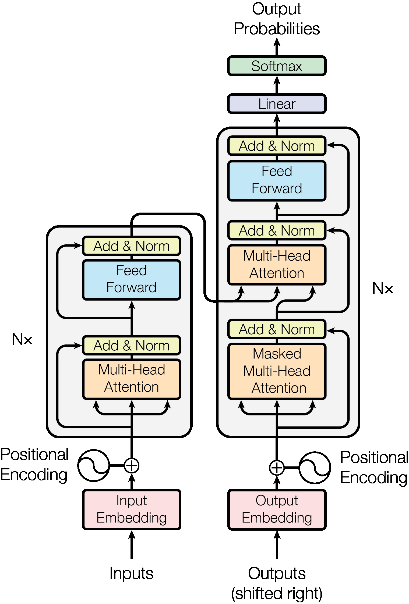
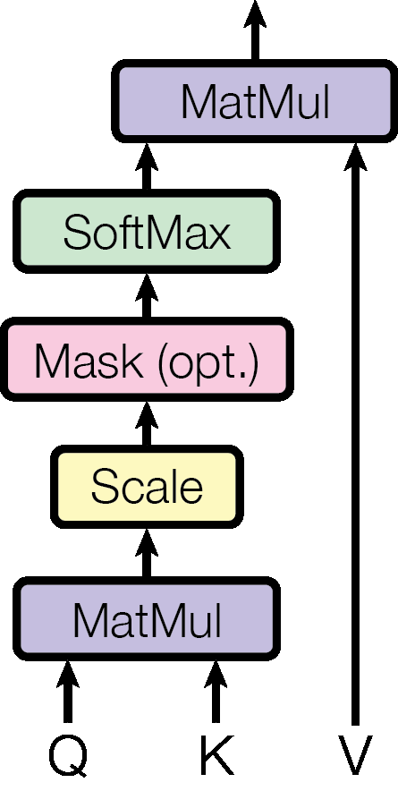
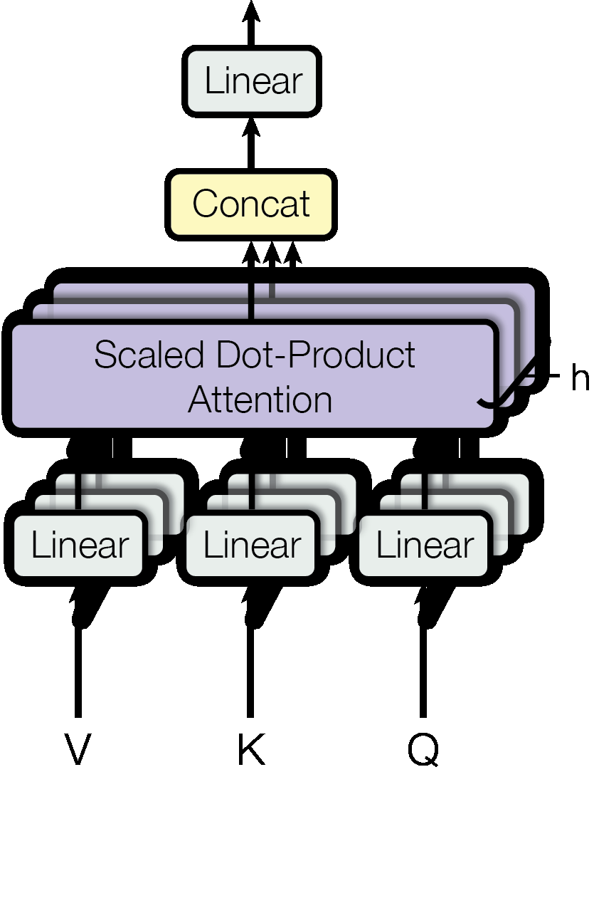

## 1. Introducción

Las redes neuronales recurrentes, la memoria a largo plazo [13] y las redes neuronales recurrentes [7] en particular, se han establecido firmemente como enfoques de última generación en los problemas de modelado y transducción de secuencias, como el modelado de idiomas y la traducción automática [35, 2, 2, 5].Desde entonces, numerosos esfuerzos han seguido empujando los límites de los modelos de idiomas recurrentes y las arquitecturas de codificadores del codificador [38, 24, 15].Los modelos recurrentes generalmente tienen en cuenta el cálculo a lo largo de las posiciones de símbolos de las secuencias de entrada y salida.Alineando las posiciones a los pasos en el tiempo de cálculo, generan una secuencia de estados ocultos HT, en función del estado oculto HT - 1 anterior y la entrada para la posición t.Esta naturaleza inherentemente secuencial impide la paralelización dentro de los ejemplos de capacitación, lo que se vuelve crítico a longitudes de secuencia más largas, a medida que las restricciones de memoria limitan el lote a través de los ejemplos.El trabajo reciente ha logrado mejoras significativas en la eficiencia computacional a través de los trucos de factorización [21] y el cálculo condicional [32], al tiempo que mejora el rendimiento del modelo en caso de este último.Sin embargo, la restricción fundamental del cálculo secuencial permanece.Los mecanismos de atención se han convertido en una parte integral del modelado de secuencia convincente y los modelos de transducción en varias tareas, lo que permite el modelado de dependencias sin tener en cuenta su distancia en las secuencias de entrada o salida [2, 19].Sin embargo, en todos los pocos casos [27], tales mecanismos de atención se utilizan junto con una red recurrente.En este trabajo proponemos el transformador, una arquitectura modelo evita la recurrencia y, en su lugar, dependemos completamente de un mecanismo de atención para atraer dependencias globales entre la entrada y la salida.El transformador permite una paralelización significativamente más y puede alcanzar un nuevo estado del arte en calidad de traducción después de recibir capacitación durante tan solo doce horas en ocho GPU de P100.

## 2. Fondo

El objetivo de reducir el cálculo secuencial también forma la base de la GPU neural extendida [16], Bytenet [18] y Convs2S [9], todas las cuales utilizan redes neuronales convolucionales como bloque de construcción básica, calculando representaciones ocultas en paralelo para todas las entradas yPosiciones de salida.En estos modelos, el número de operaciones requeridas para relacionar señales de dos posiciones de entrada o salida arbitrarias crece en la distancia entre las posiciones, linealmente para Convs2 y logarítmicamente para Bytenet.Esto hace que sea más difícil aprender dependencias entre posiciones distantes [12].En el transformador, esto se reduce a un número constante de operaciones, aunque a costa de una resolución efectiva reducida debido al promedio de posiciones ponderadas de atención, un efecto que contrarrestamos con la atención de múltiples cabezas como se describe en la Sección 3.2.La autoatención, a veces llamada intraeTess, es un mecanismo de atención que relaciona diferentes posiciones de una sola secuencia para calcular una representación de la secuencia.La autoatación se ha utilizado con éxito en una variedad de tareas, incluida la comprensión de lectura, el resumen abstracto, la implicación textual y las representaciones de oraciones independientes de la tarea de aprendizaje [4, 27, 28, 22].Las redes de memoria de extremo a extremo se basan en un mecanismo de atención recurrente en lugar de la recurrencia secuenciada y se ha demostrado que funcionan bien en las tareas de respuesta de preguntas y modelado de idiomas [34].Sin embargo, hasta donde sabemos, el transformador es el primer modelo de transducción que depende completamente de la autoatición para calcular las representaciones de su entrada y salida sin usar RNN o convolución secuenciado.En las siguientes secciones, describiremos el transformador, motivaremos la autoatención y discutiremos sus ventajas sobre modelos como [17, 18] y [9].

## 3 Arquitectura de modelos

La mayoría de los modelos de transducción de secuencia neuronal competitiva tienen una estructura de codificador codificador [5, 2, 35].Aquí, el codificador asigna una secuencia de entrada de representaciones de símbolos (x1, ..., xn) a una secuencia de representaciones continuas z = (z1, ..., zn).Dado Z, el decodificador luego genera una secuencia de salida (y1, ..., ym) de símbolos un elemento a la vez.En cada paso, el modelo es automático [10], consumiendo los símbolos generados anteriormente como entrada adicional al generar la siguiente.

 Figura 1: El transformador - Arquitectura del modelo.El transformador sigue esta arquitectura general utilizando la autoatencia apilada y capas puntiagudas y totalmente conectadas tanto para el codificador como para el decodificador, que se muestran en las mitades izquierda y derecha de la Figura 1, respectivamente.

### 3.1 Pilas de codificadores y decodificadores

Codador: el codificador está compuesto por una pila de n = 6 capas idénticas.Cada capa tiene dos subcapas.El primero es un mecanismo de autoatención de múltiples cabezas, y el segundo es una red de alimentación simple y totalmente conectada de posición de posición.Empleamos una conexión residual [11] alrededor de cada una de las dos subcapacias, seguido de la normalización de la capa [1].Es decir, la salida de cada subcapa es la tormenta de Layerner (X + SuBlayer (x)), donde la subcamencia (x) es la función implementada por la propia subcapa.Para facilitar estas conexiones residuales, todas las capasas en el modelo, así como las capas de incrustación, producen salidas de dimensión dmodel = 512. decodificador: el decodificador también está compuesto por una pila de n = 6 capas idénticas.Además de las dos submenditas en cada capa de codificador, el decodificador inserta una tercera subcapa, que realiza atención múltiple sobre la salida de la pila del codificador.Similar al codificador, empleamos conexiones residuales alrededor de cada una de las subcapas, seguido de la normalización de la capa.También modificamos la subcaptura de autoatención en la pila de decodificadores para evitar que las posiciones atendan a posiciones posteriores.Este enmascaramiento, combinado con el hecho de que los incrustaciones de salida se compensan con una posición, asegura que las predicciones para la posición I puedan depender solo de las salidas conocidas en posiciones inferiores a i.

### 3.2 Atención

Se puede describir una función de atención como mapeo de una consulta y un conjunto de pares de valor clave a una salida, donde la consulta, las claves, los valores y la salida son todos vectores.La salida se calcula como una suma ponderada a escala la atención del producto de punto 

 Atención de cabezales múltiples 

 Figura 2: (izquierda) Atención del producto DOT escalado.(Derecha) La atención de múltiples cabezas consiste en varias capas de atención que se ejecutan en paralelo.de los valores, donde el peso asignado a cada valor se calcula mediante una función de compatibilidad de la consulta con la clave correspondiente.

#### 3.2.1 Atención de productos de puntos escalados

Llamamos a nuestra atención particular "atención al producto de punto escalado" (Figura 2).La entrada consiste en consultas y claves de dimensión DK, y valores de dimensión DV.Calculamos los productos DOT de la consulta con todas las claves, dividimos cada una por √dk y aplicamos una función Softmax para obtener los pesos en los valores.En la práctica, calculamos la función de atención en un conjunto de consultas simultáneamente, empacadas en una matriz Q. Las teclas y los valores también se unen en las matrices K y V.Calculamos la matriz de salidas como: Atención (Q, K, V) = Softmax (Qkt √DK) V (1) Las dos funciones de atención más utilizadas son atención aditiva [2] y atención de producto (multiplicativo).La atención del producto DOT es idéntica a nuestro algoritmo, excepto por el factor de escala de 1 √DK.La atención aditiva calcula la función de compatibilidad utilizando una red de alimentación con una sola capa oculta.Si bien los dos son similares en la complejidad teórica, la atención del producto DOT es mucho más rápida y más eficiente en el espacio en la práctica, ya que puede implementarse utilizando un código de multiplicación de matriz altamente optimizado.Mientras que para valores pequeños de DK, los dos mecanismos funcionan de manera similar, la atención aditiva supera la atención del producto DOT sin escalar valores mayores de DK [3].Sospechamos que para los valores grandes de DK, los productos DOT crecen en magnitud, empujando la función Softmax a las regiones donde tiene gradientes extremadamente pequeños 4. Para contrarrestar este efecto, escala los productos DOT en 1 √dk.

#### 3.2.2 Atención múltiple de cabeza

En lugar de realizar una sola función de atención con claves, valores y consultas dmodel-dimensionales, nos pareció beneficioso proyectar linealmente las consultas, claves y valores H tiempos con diferentes proyecciones lineales aprendidas a dimensiones DK, DK y DV, respectivamente.En cada una de estas versiones proyectadas de consultas, claves y valores, realizamos la función de atención en paralelo, produciendo 4 para ilustrar por qué los productos DOT se vuelven grandes, supongamos que los componentes de Q y K son variables aleatorias independientes con media 0 yVarianza 1. entonces su producto DOT, q · k = �dk i = 1 qiki, tiene media 0 y varianza dk.valores de salida.Estos se concatenan y se proyectan una vez más, lo que resulta en los valores finales, como se muestra en la Figura 2. La atención de múltiples cabezas permite que el modelo atiende conjuntamente información de diferentes subespacios de representación en diferentes posiciones.Con una sola cabeza de atención, el promedio inhibe esto.Multihead (Q, K, V) = Concat (Head1, ..., Headh) w o donde headi = atención (qw q i, kw k i, v w v i) donde las proyecciones son matrices de parámetros w q i ∈ Rdmodel × dk, w ki ∈ Rdmodel × dk, w v i ∈ Rdmodel × dv y w o ∈ Rhdv × dmodel.En este trabajo empleamos H = 8 capas o cabezas de atención paralela.Para cada uno de estos usamos dk = dv = dmodel/h = 64. Debido a la dimensión reducida de cada cabezal, el costo computacional total es similar al de la atención de un solo jefe con dimensionalidad completa.

#### 3.2.3 Aplicaciones de atención en nuestro modelo

El transformador utiliza la atención de múltiples cabezas de tres maneras diferentes: • En las capas de "atención del decodificador del codificador", las consultas provienen de la capa de decodificador anterior y las teclas de memoria y los valores provienen de la salida del codificador.Esto permite que cada posición en el decodificador asista a través de todas las posiciones en la secuencia de entrada.Esto imita los mecanismos típicos de atención del codificador codificador en modelos de secuencia a secuencia como [38, 2, 9].• El codificador contiene capas de autoatimiento.En una capa de autoatención, todas las claves, valores y consultas provienen del mismo lugar, en este caso, la salida de la capa anterior en el codificador.Cada posición en el codificador puede atender todas las posiciones en la capa anterior del codificador.• Del mismo modo, las capas de autoatención en el decodificador permiten que cada posición en el decodificador atiende a todas las posiciones en el decodificador hasta esa posición.Necesitamos evitar el flujo de información hacia la izquierda en el decodificador para preservar la propiedad automática.Implementamos esto dentro de la atención de producto de punto escalado enmascarando (configuración en −∞) Todos los valores en la entrada del Softmax que corresponden a conexiones ilegales.Ver Figura 2.

### 3.3 Redes de alimentación en cuanto a posición

Además de los subcapacia de atención, cada una de las capas en nuestro codificador y decodificador contiene una red de alimentación completamente conectada, que se aplica a cada posición por separado e idénticamente.Esto consiste en dos transformaciones lineales con una activación de RELU en el medio.Ffn (x) = max (0, xw1 + b1) w2 + b2 (2) Si bien las transformaciones lineales son las mismas en diferentes posiciones, usan diferentes parámetros de una capa a otra.Otra forma de describir esto es como dos convoluciones con el tamaño del núcleo 1. La dimensionalidad de entrada y salida es dmodel = 512, y la capa interna tiene dimensionalidad DFF = 2048.

### 3.4 incrustaciones y softmax

De manera similar a otros modelos de transducción de secuencia, utilizamos incrustaciones aprendidas para convertir los tokens de entrada y los tokens de salida a vectores de dmodelo de dimensión.También utilizamos la transformación lineal aprendida habitual y la función SoftMax para convertir la salida del decodificador en probabilidades previstas de la próxima token.En nuestro modelo, compartimos la misma matriz de peso entre las dos capas de incrustación y la transformación lineal pre-Softmax, similar a [30].En las capas de incrustación, multiplicamos esos pesos por √dmodel.Tabla 1: Longitudes máximas de ruta, complejidad de la capa y número mínimo de operaciones secuenciales para diferentes tipos de capa.n es la longitud de la secuencia, D es la dimensión de representación, k es el tamaño del núcleo de las convoluciones y r el tamaño del vecindario en la autoatención restringida.Complejidad del tipo de capa por capa Operaciones de longitud de ruta máxima secuencial

### 3.5 Codificación posicional

Dado que nuestro modelo no contiene recurrencia ni convolución, para que el modelo haga uso del orden de la secuencia, debemos inyectar cierta información sobre la posición relativa o absoluta de los tokens en la secuencia.Con este fin, agregamos "codificaciones posicionales" a los incrustaciones de entrada en la parte inferior del codificador y las pilas de decodificadores.Las codificaciones posicionales tienen la misma dimensión dmodelo que los incrustaciones, de modo que se puedan sumar los dos.Hay muchas opciones de codificaciones posicionales, aprendidas y fijas [9].En este trabajo, utilizamos funciones seno y coseno de diferentes frecuencias: PE (pos, 2i) = sin (POS/100002i/DModel) PE (POS, 2i+1) = cos (POS/100002i/DModel) donde POS es elposición y yo es la dimensión.Es decir, cada dimensión de la codificación posicional corresponde a un sinusoide.Las longitudes de onda forman una progresión geométrica de 2π a 10000 · 2π.Elegimos esta función porque planteamos la hipótesis de que permitiría que el modelo aprenda fácilmente a asistir por posiciones relativas, ya que para cualquier desplazamiento fijo K, Pepos+K puede representarse como una función lineal de Pepos.También experimentamos con el uso de incrustaciones posicionales aprendidas [9], y encontramos que las dos versiones produjeron resultados casi idénticos (ver Tabla 3 Fila (E)).Elegimos la versión sinusoidal porque puede permitir que el modelo extrapole a longitudes de secuencia más largas que las que se encuentran durante el entrenamiento.

## 4 Por qué autoatención

En esta sección comparamos varios aspectos de las capas de autoatición con las capas recurrentes y convolucionales comúnmente utilizadas para mapear una secuencia de representaciones de símbolos de longitud variable (x1, ..., xn) a otra secuencia de igual longitud (Z1, ..., Zn), con xi, zi ∈ Rd, como una capa oculta en un codificador o decodificador de transducción de secuencia típico.Motivando nuestro uso de la autoatención consideramos tres desiderata.Uno es la complejidad computacional total por capa.Otra es la cantidad de cálculo que puede ser paralelo, según lo medido por el número mínimo de operaciones secuenciales requeridas.El tercero es la longitud de la ruta entre las dependencias de largo alcance en la red.Aprender dependencias de largo alcance es un desafío clave en muchas tareas de transducción de secuencias.Un factor clave que afecta la capacidad de aprender tales dependencias es la longitud de las rutas hacia adelante y las señales hacia atrás tienen que atravesar en la red.Cuanto más cortas estén estas rutas entre cualquier combinación de posiciones en las secuencias de entrada y salida, más fácil es aprender dependencias de largo alcance [12].Por lo tanto, también comparamos la longitud de ruta máxima entre dos posiciones de entrada y salida en redes compuestas por los diferentes tipos de capa.Como se señaló en la Tabla 1, una capa de autoatición conecta todas las posiciones con un número constante de operaciones ejecutadas secuencialmente, mientras que una capa recurrente requiere operaciones secuenciales O (n).En términos de complejidad computacional, las capas de autoatición son más rápidas que las capas recurrentes cuando la longitud de secuencia n es menor que la dimensionalidad de representación d, que a menudo es el caso con las representaciones de oraciones utilizadas por modelos de última generación en traducciones automáticas, como representaciones de palabras [38] y par de bytes [31].Para mejorar el rendimiento computacional para las tareas que involucran secuencias muy largas, la autoatición podría restringirse a considerar solo un vecindario de tamaño R en la secuencia de entrada centrada en la posición de salida respectiva.Esto aumentaría la longitud máxima del camino a O (N/R).Planeamos investigar este enfoque aún más en el trabajo futuro.Una sola capa convolucional con ancho del núcleo K <n no conecta todos los pares de posiciones de entrada y salida.Hacerlo requiere una pila de capas convolucionales O (n/k) en el caso de núcleos contiguos, o o (logk (n)) en el caso de convoluciones dilatadas [18], aumentando la longitud de las rutas más largas entre dos posicionesen la red.Las capas convolucionales son generalmente más caras que las capas recurrentes, por un factor de k.Sin embargo, las convoluciones separables [6] disminuyen la complejidad considerablemente, a O (k · n · d + n · d2).Incluso con K = N, sin embargo, la complejidad de una convolución separable es igual a la combinación de una capa de autoatensión y una capa de alimentación puntual, el enfoque que adoptamos en nuestro modelo.Como beneficio secundario, la autoatención podría producir modelos más interpretables.Inspeccionamos las distribuciones de atención de nuestros modelos y presentamos y discutimos ejemplos en el apéndice.Los cabezas de atención individuales no solo aprenden claramente a realizar diferentes tareas, sino que muchos parecen exhibir un comportamiento relacionado con la estructura sintáctica y semántica de las oraciones.

## 5 entrenamiento

Esta sección describe el régimen de capacitación para nuestros modelos.

### 5.1 Datos de entrenamiento y lotes

Nos capacitamos en el conjunto de datos inglés-alemán WMT 2014 estándar que consta de aproximadamente 4,5 millones de pares de oraciones.Las oraciones se codificaron utilizando la codificación de pares de byte [3], que tiene un vocabulario de fianza compartida de aproximadamente 37000 tokens.Para el inglés-francés, utilizamos el conjunto de datos WMT 2014 en inglés-francés WMT 2014 que consta de oraciones de 36 m y tokens divididos en un vocabulario de 32000 palabras [38].Los pares de oraciones se combinaron por longitud de secuencia aproximada.Cada lote de entrenamiento contenía un conjunto de pares de oraciones que contenían aproximadamente 25000 tokens de origen y 25000 tokens objetivo.

### 5.2 Hardware y programa

Entrenamos nuestros modelos en una máquina con 8 GPU NVIDIA P100.Para nuestros modelos base utilizando los hiperparámetros descritos en todo el papel, cada paso de entrenamiento tardó aproximadamente 0.4 segundos.Entrenamos los modelos base para un total de 100,000 pasos o 12 horas.Para nuestros grandes modelos, (descrito en la línea final de la Tabla 3), el tiempo de paso fue de 1.0 segundos.Los grandes modelos fueron entrenados para 300,000 pasos (3.5 días).

### 5.3 Optimizador

Utilizamos el ADAM Optimizer [20] con β1 = 0.9, β2 = 0.98 y ϵ = 10−9.Variamos la tasa de aprendizaje en el transcurso de la capacitación, de acuerdo con la fórmula: lrate = d - 0.5 modelo · min (step_num - 0.5, step_num · warmup_steps - 1.5) (3) Esto corresponde a aumentar la tasa de aprendizaje linealmente para el primer topado de tope.Pasos de entrenamiento, y disminuyendo a partir de entonces proporcionalmente a la raíz cuadrada inversa del número de paso.Usamos Warmup_steps = 4000.

### 5.4 Regularización

Empleamos tres tipos de regularización durante la capacitación: Tabla 2: El transformador logra mejores puntajes BLEU que los modelos de vanguardia anteriores en las pruebas de inglés a alemán y en inglés a francés 2014 a una fracción del costo de capacitación.Costo de entrenamiento de modelo BLEU (FLOPS) EN-DE EN-FR EN-DE EN-FR BYTENET [18] 23.75 de intervención profunda + Posunk [39] 39.2 1.0 · 1020 Entre de intervalos + Posunk Ensemble [39] 40.4 8.0 · 1020 Transformador(Modelo base) 27.3 38.1 3.3 · 1018 Descarga residual Aplicamos que abandonamos [33] a la salida de cada subcapa, antes de que se agregue a la entrada de la subcapa y se normalizara.Además, aplicamos abandonos a las sumas de los incrustaciones y las codificaciones posicionales tanto en las pilas de codificador como en el decodificador.Para el modelo base, utilizamos una tasa de PDROP = 0.1.Suavizado de etiquetas Durante la capacitación, empleamos suavizado de la etiqueta de valor ϵLS = 0.1 [36].Esto duele la perplejidad, ya que el modelo aprende a estar más inseguro, pero mejora la precisión y la puntuación BLEU.

## 6 resultados

### 6.1 Traducción automática

En la tarea de traducción de inglés a alemán WMT 2014, el modelo de transformador Big (Transformer (Big) en la Tabla 2) supera a los mejores modelos previamente informados (incluidos conjuntos) en más de 2.0 Bleu, estableciendo un nuevo estado de la-Art Bleu Score of 28.4.La configuración de este modelo se enumera en la línea final de la Tabla 3. El entrenamiento tomó 3.5 días en 8 GPU P100.Incluso nuestro modelo base supera todos los modelos y conjuntos publicados previamente, a una fracción del costo de capacitación de cualquiera de los modelos competitivos.En la tarea de traducción de inglés a francés WMT 2014, nuestro gran modelo logra una puntuación BLEU de 41.0, superando a todos los modelos individuales publicados anteriormente, a menos de 1/4 del costo de capacitación del estado anterior de estado de arte anteriormodelo.El modelo de transformador (grande) entrenado para inglés a francés usó tasa de abandono PDrop = 0.1, en lugar de 0.3.Para los modelos base, utilizamos un modelo único obtenido promediando los últimos 5 puntos de control, que se escribieron a intervalos de 10 minutos.Para los grandes modelos, promediamos los últimos 20 puntos de control.Utilizamos la búsqueda de haz con un tamaño de haz de 4 y penalización de longitud α = 0.6 [38].Estos hiperparámetros se eligieron después de la experimentación en el conjunto de desarrollo.Establecimos la longitud de salida máxima durante la inferencia a la longitud de entrada + 50, pero terminamos temprano cuando sea posible [38].La Tabla 2 resume nuestros resultados y compara nuestra calidad de traducción y costos de capacitación con otras arquitecturas modelo de la literatura.Estimamos el número de operaciones de puntos flotantes utilizados para capacitar a un modelo multiplicando el tiempo de entrenamiento, el número de GPU utilizadas y una estimación de la capacidad sostenida de punto flotante de precisión de cada GPU 5.

### 6.2 Variaciones del modelo

Para evaluar la importancia de los diferentes componentes del transformador, variamos nuestro modelo base de diferentes maneras, midiendo el cambio en el rendimiento en la traducción de inglés a alemán en los valores usados 5 de 2.8, 3.7, 6.0 y 9.5 Tflops para K80, K40, K40, M40 y P100, respectivamente.Tabla 3: Variaciones en la arquitectura del transformador.Los valores no listados son idénticos a los del modelo base.Todas las métricas están en el conjunto de desarrollo de traducción en inglés a alemán, NewStest2013.Las perplejidades enumeradas son por palabra, según nuestra codificación de pares de bytes, y no deben compararse con perplejidades por palabra.Pasos (dev) (dev) × 106 (a) (c) (d) (e) Incrustación posicional en lugar de sinusoides 4.92 25.7 Conjunto de desarrollo, NewStest2013.Utilizamos la búsqueda de haz como se describe en la sección anterior, pero no hay promedio de punto de control.Presentamos estos resultados en la Tabla 3. En la Tabla 3 filas (a), variamos el número de cabezales de atención y la clave de atención y las dimensiones de valor, manteniendo constante la cantidad de cálculo, como se describe en la Sección 3.2.2.Si bien la atención de una sola cabeza es 0.9 Bleu peor que la mejor configuración, la calidad también cae con demasiadas cabezas.En la Tabla 3 de las filas (b), observamos que reducir el tamaño de la clave de atención DK duele la calidad del modelo.Esto sugiere que determinar la compatibilidad no es fácil y que una función de compatibilidad más sofisticada que el producto DOT puede ser beneficioso.Observamos aún más en las filas (c) y (d) que, como se esperaba, los modelos más grandes son mejores, y el abandono es muy útil para evitar el ajuste excesivo.En la fila (e) reemplazamos nuestra codificación posicional sinusoidal con incrustaciones posicionales aprendidas [9], y observamos resultados casi idénticos al modelo base.

### 6.3 Análisis de la circunscripción inglesa

Para evaluar si el transformador puede generalizarse a otras tareas, realizamos experimentos sobre el análisis de la circunscripción inglesa.Esta tarea presenta desafíos específicos: la salida está sujeta a fuertes restricciones estructurales y es significativamente más larga que la entrada.Además, los modelos de secuencia a secuencia de RNN no han podido lograr resultados de última generación en regímenes de datos pequeños [37].Entrenamos un transformador de 4 capas con dmodel = 1024 en la porción de Wall Street Journal (WSJ) del Penn Treebank [25], aproximadamente 40k oraciones de entrenamiento.También lo capacitamos en un entorno semi-supervisado, utilizando los corporativos más grandes de alta confianza y BerkleyParser de con aproximadamente 17 millones de oraciones [37].Utilizamos un vocabulario de tokens 16k para el entorno WSJ Only y un vocabulario de tokens 32k para el entorno semi-supervisado.Realizamos solo un pequeño número de experimentos para seleccionar el abandono, tanto la atención y el residuo (Sección 5.4), las tasas de aprendizaje y el tamaño del haz en el conjunto de desarrollo de la Sección 22, todos los demás parámetros permanecieron sin cambios desde el modelo de traducción base de inglés a alemán.Durante la inferencia, la Tabla 4: el transformador generaliza bien a inglés.Alabama.(2015) [23] Tarea multitarea 93.0 Dyer et al.(2016) [8] Generativo 93.3 aumentó la longitud máxima de salida a la longitud de entrada + 300. Utilizamos un tamaño de haz de 21 y α = 0.3 solo para WSJ y la configuración semi-supervisada.Nuestros resultados en la Tabla 4 muestran que a pesar de la falta de ajuste específica de tareas, nuestro modelo funciona sorprendentemente bien, produciendo mejores resultados que todos los modelos informados previamente con la excepción de la gramática de la red neuronal recurrente [8].A diferencia de los modelos de secuencia a secuencia de RNN [37], el transformador supera al BerkeleParser [29] incluso cuando se capacita solo en el conjunto de entrenamiento de WSJ de 40k oraciones.

## 7. Conclusión

En este trabajo, presentamos el transformador, el primer modelo de transducción de secuencia basado completamente en la atención, reemplazando las capas recurrentes más utilizadas en las arquitecturas de codificadores de codificadores con autoatención de múltiples cabezas.Para las tareas de traducción, el transformador puede ser entrenado significativamente más rápido que las arquitecturas basadas en capas recurrentes o convolucionales.Tanto en las tareas de traducción de inglés a alemán de WMT 2014 como WMT 2014, logramos un nuevo estado del arte.En la tarea anterior, nuestro mejor modelo supera incluso todos los conjuntos previamente reportados.Estamos entusiasmados con el futuro de los modelos basados en la atención y planean aplicarlos a otras tareas.Planeamos extender el transformador a problemas que involucran modalidades de entrada y salida que no sean texto e investigar mecanismos de atención restringidos locales y restringidos para manejar de manera eficiente entradas y salidas grandes como imágenes, audio y video.Hacer que la generación sea menos secuencial son otros objetivos de investigación nuestros.El código que usamos para entrenar y evaluar nuestros modelos está disponible en https://github.com/ tensorflow/tensor2tensor.Agradecimientos Agradecemos a Nal Kalchbrenner y Stephan Gouws por sus fructíferos comentarios, correcciones e inspiración.

